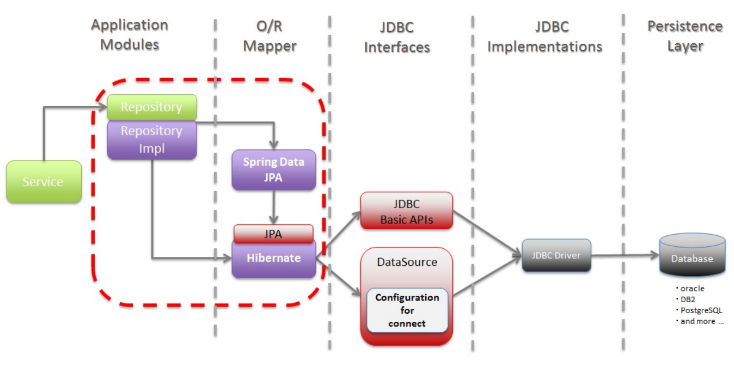

#Spring Data JPA Work Flow

1) Server gọi tới Repository mà nó cần để thực hiện lấy dữ liệu. Repository là một interface kế thừa một trong những Repository Interfaces (CrudRepository, JpaRepository, ...) mà Spring Data JPA cung cấp sẵn.

2) Vì Repository là một Interface nên ta phải viết định nghĩa cho nó thông qua Repository Impl. Mặc khác, Repository kế thừa từ những Repository intefaces mà Spring Data JPA cung cấp nên ở Repository Impl ta có thể không cần viết code mà có thể sử dụng các method có sẵn trong CrudRepository hoặc JpaRepository (ví dụ như findById(), findByName(), ...)

3) Tiếp theo, Spring Data JPA sẽ gọi JPA để tiến hành ánh xạ các giữa đối tượng Object và Table tương ứng trong CSDL. Ở đây JPA sẽ mang nhiệm vụ định nghĩa ra cách mapping và Hibernate sẽ đảm nhận việc mapping dựa trên định nghĩa đó.

4) Tiếp theo, Hibernate sẽ sinh ra các config để kết nối với DB và các câu lệnh Query Data dựa theo các method trong Repository Impl. Sau đó, gửi chúng cho JDBC Basic APIs.

5) JDBC Basic APIs sẽ tiến hành giao tiếp với DB thông qua JDBC Driver. Sau đó lấy dữ liệu từ DB và trả về.