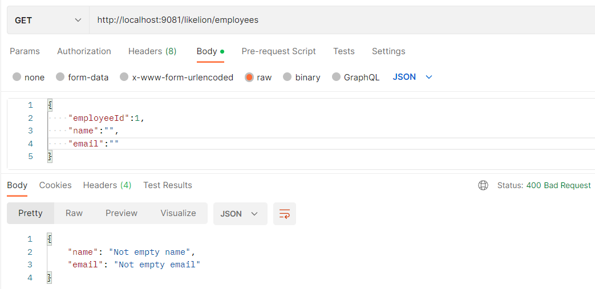

# Practice Week 8-1, 8-2

## Part 1

### Task 1

***
### Task 2
#### Validate EmployeeDTO

- Case 1: name and email are empty

- Case 2: the length of name not be between 10 and 50 and email not in correct format

****
#### Validate DepartmentDTO

- Case 1: deptName and description are empty

- Case 2: the length of deptName not be between 10 and 50 and check valid employeeList

****
### Task 3
#### Logging Before and after call method getDepartmentDto

****
#### Logging after call method getEmployeeDto call failed

****
## Part 2

### Task 1

****
### Task 2

