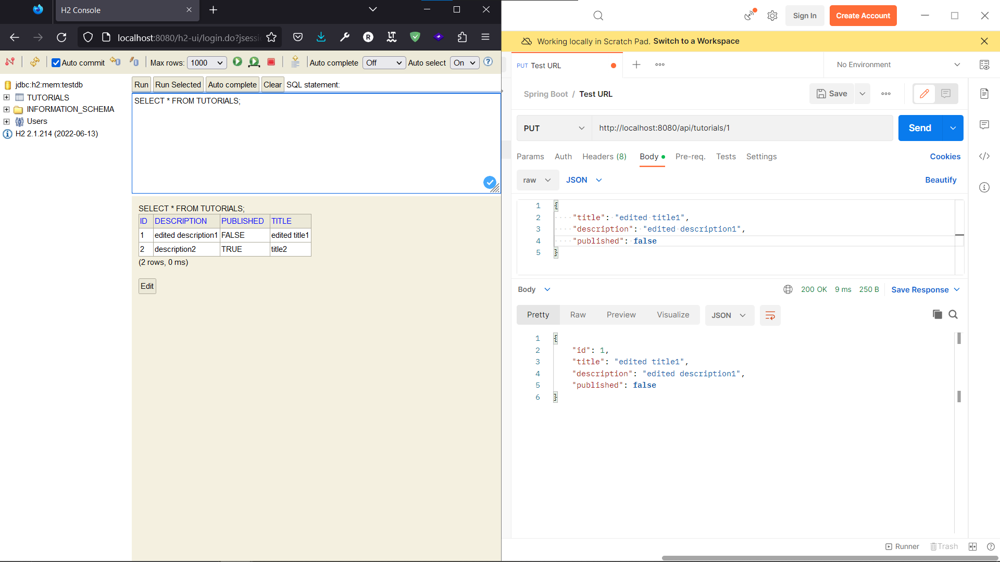
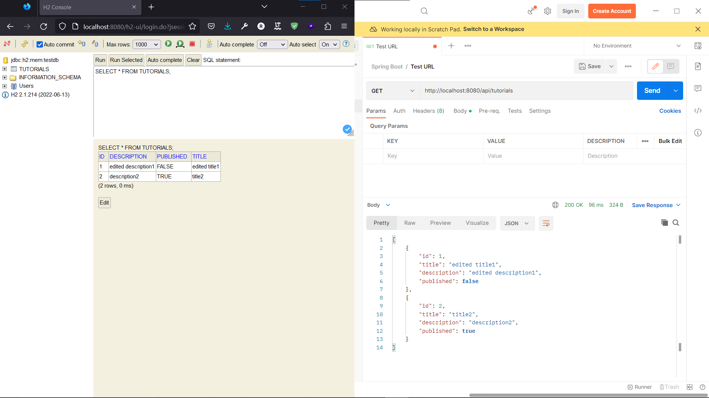
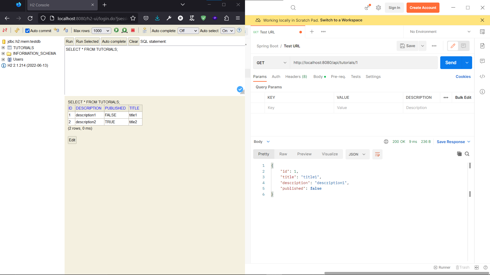
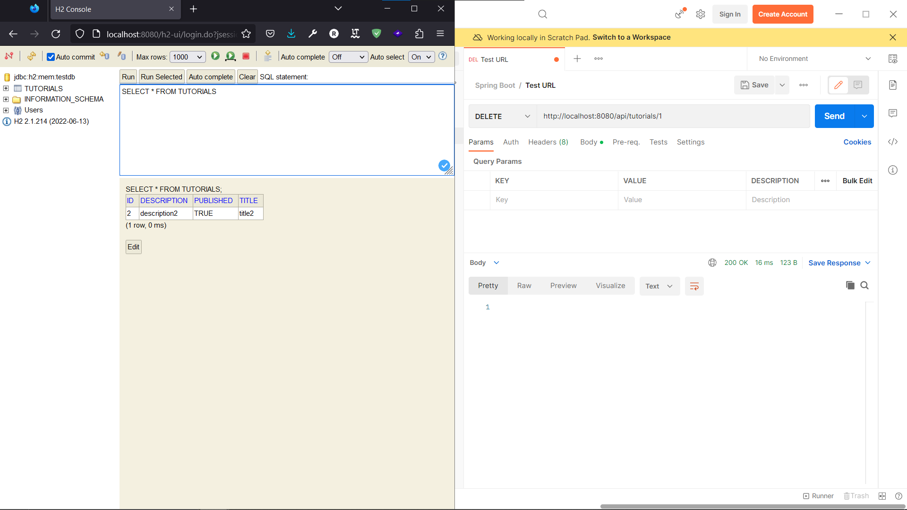

# Mô tả kết quả Test API

## POST: /api/tutorials

## PUT: /api/tutorials/{id}
**update tutorial by id = 1**

## GET: /api/tutorials?title=[keyword]
**get a list of tutorials whose title contain keyword**

## GET: /api/tutorials/published
**get a list of tutorials published**

## GET: /api/tutorials
**get all tutorials**

## GET: /api/tutorials/{id}
**get tutorials by id**

## DELETE: /api/tutorials/{id}

### remove tutorial by id

**Before delete**

**After delete**

## DELETE: /api/tutorials
### Remove all tutorials

**Before delete**

**After delete**

