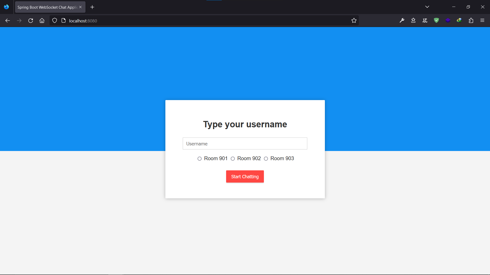
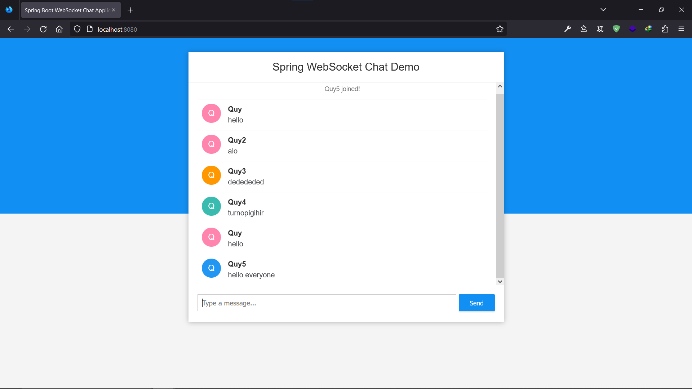
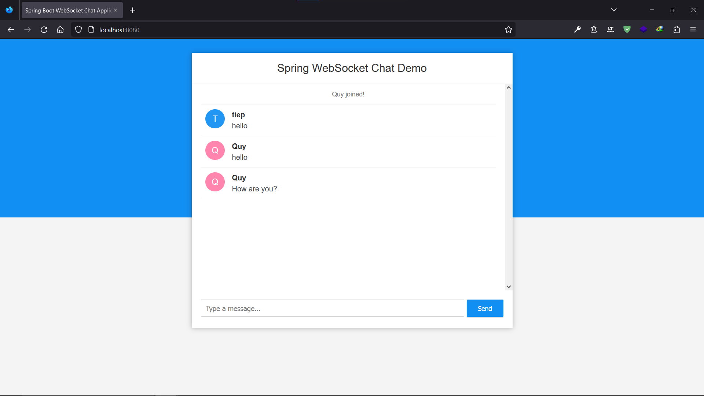
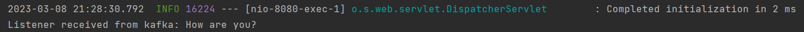
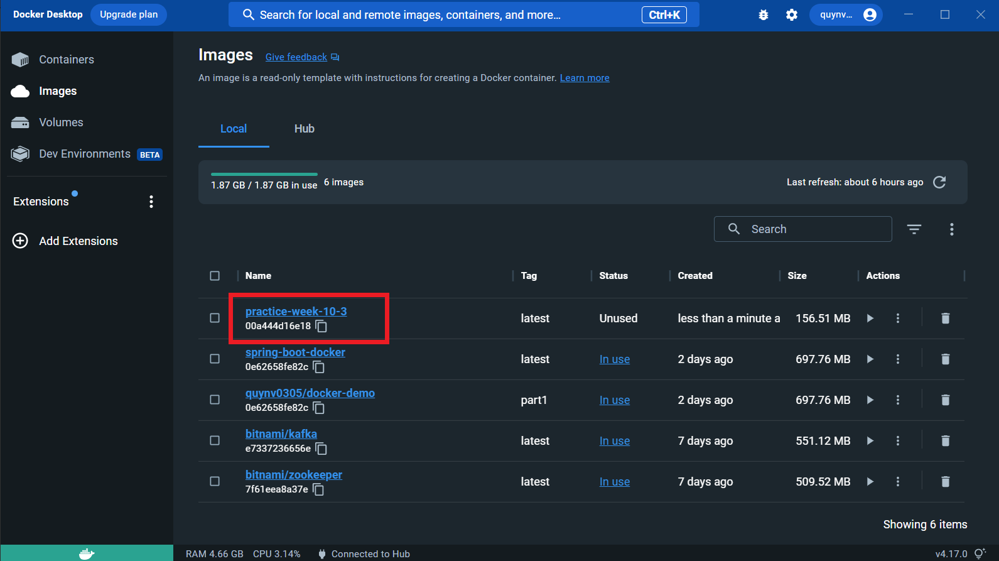
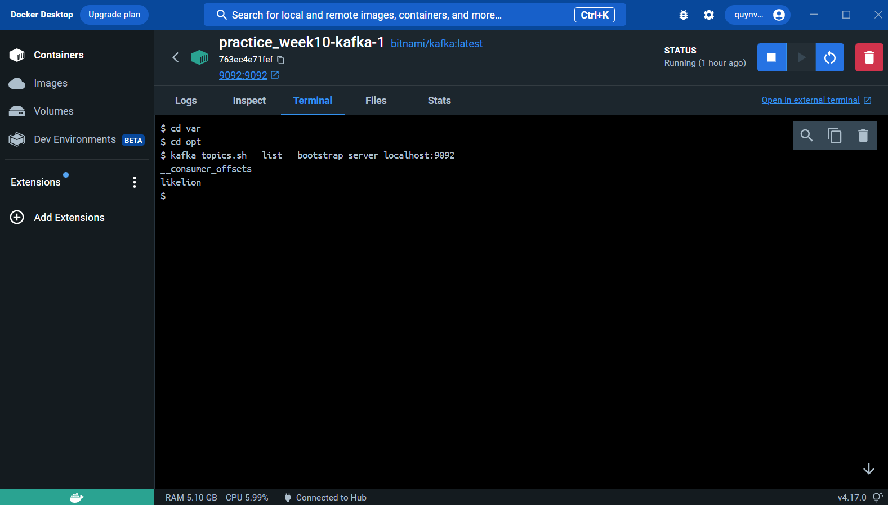
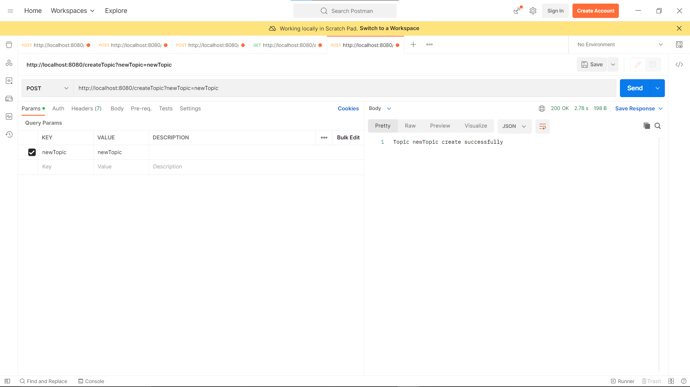
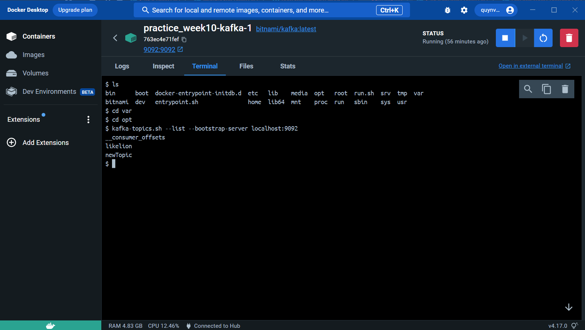
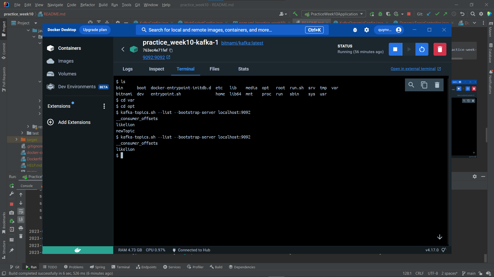

## Websocket + Redis
### Chat App Demo
- Home Page

- Chat Page
  

## Kafka
### docker-conpose.yml
```
version: "3"
services:
  zookeeper:
    image: 'bitnami/zookeeper:latest'
    ports:
      - '2181:2181'
    environment:
      - ALLOW_ANONYMOUS_LOGIN=yes
  kafka:
    image: 'bitnami/kafka:latest'
    ports:
      - '9092:9092'
    environment:
      - KAFKA_BROKER_ID=1
      - KAFKA_CFG_LISTENERS=PLAINTEXT://:9092
      - KAFKA_CFG_ADVERTISED_LISTENERS=PLAINTEXT://127.0.0.1:9092
      - KAFKA_CFG_ZOOKEEPER_CONNECT=zookeeper:2181
      - ALLOW_PLAINTEXT_LISTENER=yes
    depends_on:
      - zookeeper
```
### Kafka Config
```java
@Configuration
public class KafkaConfig {
    @Bean
    public NewTopic likelionTopic() {
        return TopicBuilder.name("likelion").build();
    }

    @Value("${spring.kafka.bootstrap-servers}")
    private String bootstrapServers;

    public Map<String, Object> producerConfig(){
        Map<String, Object> props = new HashMap<>();
        props.put(ProducerConfig.BOOTSTRAP_SERVERS_CONFIG, bootstrapServers);
        props.put(ProducerConfig.KEY_SERIALIZER_CLASS_CONFIG, StringSerializer.class);
        props.put(ProducerConfig.VALUE_SERIALIZER_CLASS_CONFIG, StringSerializer.class);
        return props;
    }    // ProducerFactory responsible for creating instances

    @Bean
    public ProducerFactory<String, String> producerFactory() {
        return new DefaultKafkaProducerFactory<>(producerConfig());
    }    // KafkaTemplate allows us to create kafka producers we need a way for us to send messages

    @Bean
    public KafkaTemplate<String, String> kafkaTemplate(ProducerFactory<String, String> producerFactory){
        return new KafkaTemplate<>(producerFactory);
    }

    public Map<String, Object> consumerConfig(){
        Map<String, Object> props = new HashMap<>();
        props.put(ConsumerConfig.BOOTSTRAP_SERVERS_CONFIG, bootstrapServers);
        props.put(ConsumerConfig.GROUP_ID_CONFIG, "groupId");
        props.put(ConsumerConfig.KEY_DESERIALIZER_CLASS_CONFIG, StringSerializer.class);
        props.put(ConsumerConfig.VALUE_DESERIALIZER_CLASS_CONFIG, StringSerializer.class);
        return props;
    }

    @Bean
    public ConsumerFactory<String, String> consumerFactory() {
        return new DefaultKafkaConsumerFactory<>(consumerConfig());
    }

    @Bean
    public KafkaListenerContainerFactory<ConcurrentMessageListenerContainer<String, String >> factory (
            ConsumerFactory<String, String> consumerFactory) {
        ConcurrentKafkaListenerContainerFactory<String, String> factory = new ConcurrentKafkaListenerContainerFactory<>();
        factory.setConsumerFactory(consumerFactory);
        return factory;
    }
}
```

#### Adjust sendMessage() method in `controller/WebController` to send message to Kafka Topic

```java
@Autowired
private KafkaTemplate kafkaTemplate;

@MessageMapping("/chat.sendMessage/{roomId}")
    @SendTo("/topic/{roomId}")
    public ChatMessage sendMessage(@Payload ChatMessage chatMessage
            , @DestinationVariable String roomId
    ) {
        redisTemplate.opsForList().rightPushAll(roomId, chatMessage);
        kafkaTemplate.send("likelion", chatMessage.getContent());
        return chatMessage;
    }
```

#### Kafka Listener
```java
@Component
public class KafkaListener {

    @org.springframework.kafka.annotation.KafkaListener(
            topics = "likelion",
            groupId = "groupId"
    )
    public void listener(ConsumerRecord<String, String> record) {
        System.out.println("Listener received from kafka: " + record.value());
    }
}
```

### Testing



### Result


## Docker Desktop

### Dockerfile
```
FROM maslick/minimalka:jdk11
VOLUME /tmp
ARG JAR_FILE=target/*.jar
COPY ${JAR_FILE} app.jar
ENTRYPOINT ["java", "-jar", "/app.jar"]
```

### Build project into Image



### Run container with image
```
docker run --name week10-3-container -p8080:8080 practice-week-10-3 
```

### Result


## Dynamic Topic
#### KafkaDynamicConfig
```java
@Configuration
public class KafkaDynamicConfig {
    @Value("${spring.kafka.bootstrap-servers}")
    private String bootstrapServers;

    private Properties props = new Properties();

    @Bean
    public Properties DynamicTopicConfig() {
        props.put(AdminClientConfig.BOOTSTRAP_SERVERS_CONFIG, bootstrapServers);
        return props;
    }

    public void createDynamicTopic(String newTopic) {
        try {
            AdminClient adminClient = AdminClient.create(props);
            NewTopic topic = new NewTopic(newTopic, Collections.emptyMap());
            adminClient.createTopics(Collections.singletonList(topic)).all().get();
        } catch (ExecutionException | InterruptedException e) {
            if (e.getCause() instanceof TopicExistsException) {
                System.out.println("Topic already exists");
            } else {
                e.printStackTrace();
            }
        }
    }

    public void deleteTopicDynamic(String oldTopic){
        try {
            AdminClient adminClient = AdminClient.create(props);
            adminClient.deleteTopics(Collections.singletonList(oldTopic)).all().get();
        }
        catch (ExecutionException | InterruptedException e){
            if (e.getCause() instanceof TopicExistsException) {
                System.out.println("Topic already exists");
            } else {
                e.printStackTrace();
            }
        }
    }
}
```

#### DynamicTopicController
```java
@RestController
public class DynamicTopicController {
    @Autowired
    private KafkaDynamicConfig kafkaDynamicConfig;

    @PostMapping("createTopic")
    public ResponseEntity<String> createTopic(@RequestParam String newTopic) {
        kafkaDynamicConfig.createDynamicTopic(newTopic);
        return ResponseEntity.ok("Topic " + newTopic + " create successfully");
    }

    @DeleteMapping("deleteTopic")
    public ResponseEntity<String> deleteTopic(@RequestParam String topic) {
        kafkaDynamicConfig.deleteTopicDynamic(topic);
        return ResponseEntity.ok("Topic " + topic + " delete successfully");
    }
}
```

#### Create New Topic
- Postman

- Kafka Terminal


#### Delete Topic
- Postman

- Kafka Terminal
